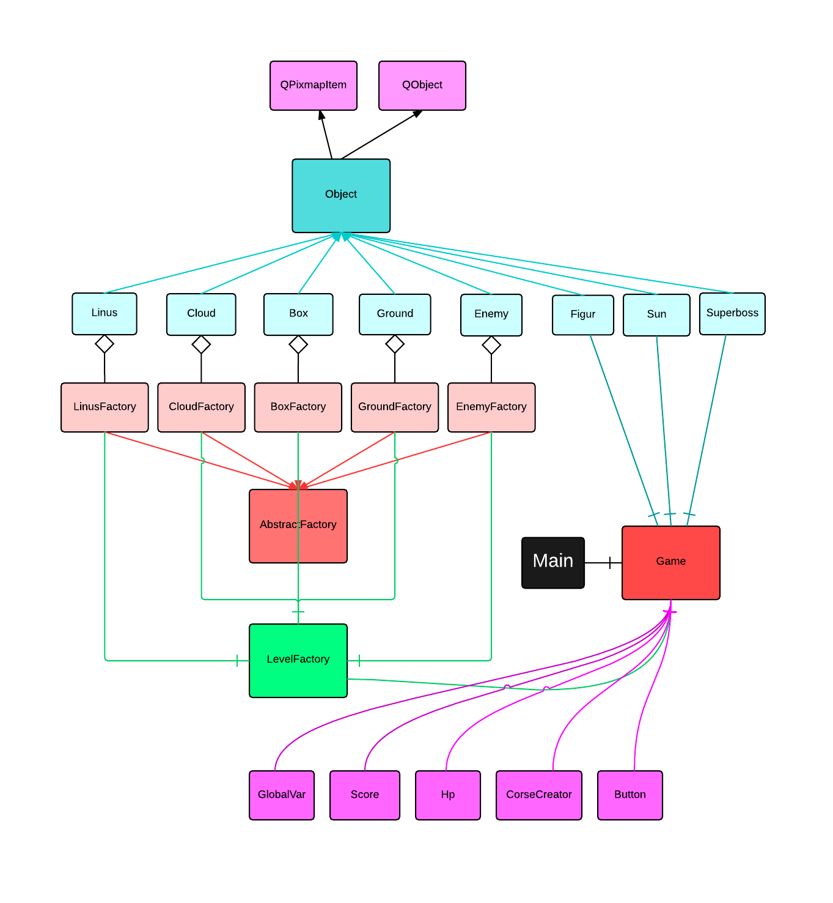

# prosjektoppgave-cpp
######Repository for Prosjektoppgave i kurset 'Effektiv kode med C og C++' (DAVE3605) vår 2015

######Gruppemedlemmer:
- Christer Bang - s198737
- Kristoffer Osen - s198754
- Trym Skilleås - s198764
- Elisabeth Kongshavn - s194524

####How to Install:

Programmet kjøres i Qt Creator.
Prosjektet lar seg importere i Qt Creator på Windows og OS X uten problemer.
På Linux er det nødvendig å innstallere libgl-dev ved hjelp av følgende kommando:

`sudo apt-get install libgl1-mesa-dev`

##Dokumentasjon:

###“Mario vs GitHub”

####Hovedopplegg:
Spillet går ut på at man styrer karakteren Mario (det ble dessverre ikke Tux) i et eventyr der han skal bekjempe onde, ressursineffektive høynivåspråk + at han samler en liten morroklump i form av bitcoins. Det ble ikke noe innsamling av nøkler for å komme til neste bane, men heller at man kunne gå inn i “røret” for å komme til neste bane - man mister muligheten til å gå tilbake til forrige bane. Vi har også lagt til litt referansehumor. ;)

Vi ville ha et skalerbart og utvidbart program og vi har derfor benyttet oss av design-patternet “abstract factory” for å få god objektorientering, og der av   
muligheten til å utvide spillet med flere brett, temaer, hindere, karakterer og lignende, samt mye gjenbrukbare kode. 

Vi bruker funksjonalitet fra QT-biblioteket for å animere objektene i spillet. Vi bruker QTimer for å styre intervallene i animasjonen. For eksempel blir mario-figuren flyttet med en QTimer som går et gitt antall ganger, avhengig av hvilken animasjon som skal gjøres (går, hopper, osv). QTimer fungerer forsjellig på forsjellige operativsystemer, beskrevet i dokumentasjonen: http://doc.qt.io/qt-4.8/qtimer.html
All animasjon i spillet er laget på en mac. Animasjonen ser anderledes ut på kurs-VMen

Vi bruker en tekstfil for å lese inn banen. Her er det lagret hvilke objekter som skal tegnes hvor, samt hvilken frame de skal tegnes på. Sånn det er nå lesees hele filen hver gang en frame skal tegnes. Dette var det meningen å effektivisere, f.eks ved å indeksere filen i frames, for å kunne lese kun det vi treger for aktuell frame. Dessverre rakk vi ikke å implementere dete. Det er Lagt til rette for at vi kan ha flere map-filer, slik at spiller lett kan utvides.

En annen tenkt funksjon som kan være vært å nevne er 'courseCreator'. Her skulle man ha muligheten til å designe baner grafisk, for så å kunne lagre og spille den. Vi var veldig nære å få til dette, men måtte gi slipp i siste liten.

Man har tilgang til en instans av game i en rekke klasser. Man har også tilgang til den gjennom klassen GlobalVar. Dette vet vi er usikkert, men det var nødvendig for å få til en del funksjonalitet, så vi valgte å la det være ettersom at sikkerhet ikke var høyt oppe på prioriteringslisten vår.

Klassene “Linus” og “LinusFactory” produserer en rekke QPixmapItems med bilde av mynter. De har disse navnene fordi de tidligere produserte bilder av hodet til Linus Torvalds, men vi endret det i siste liten, etter som at Torvalds var med å utvikle Git og det ville rart hvis han var en positiv kraft i spillet, etter som at Mario(oss på gruppen) kjemper mot Git. 

###klassediagram:

